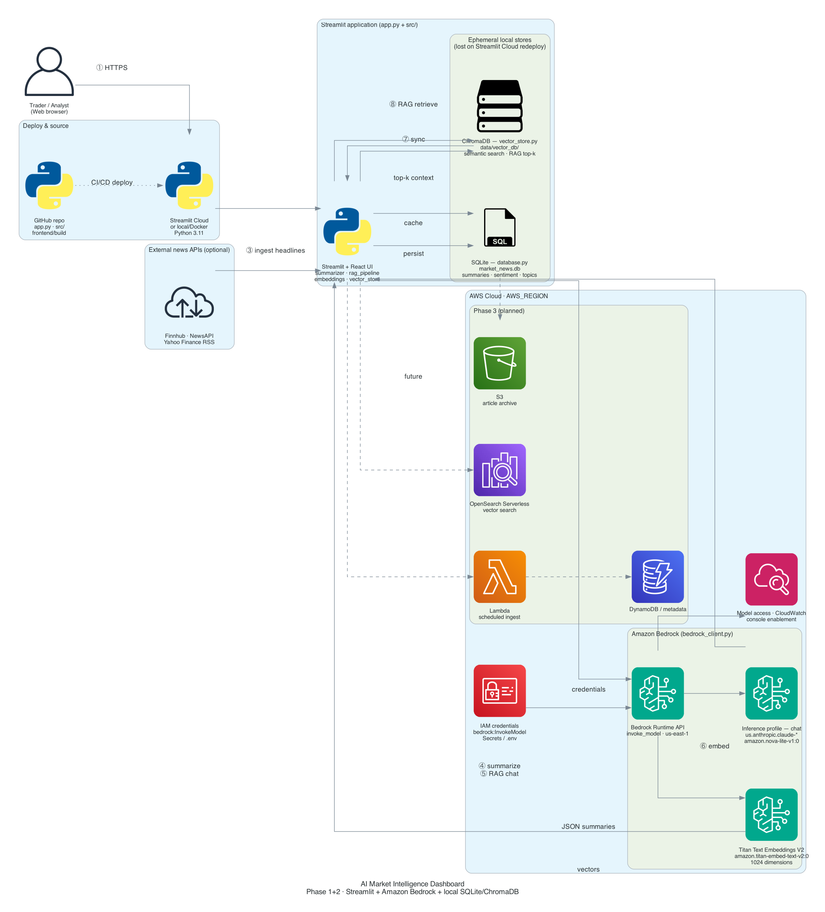

# AI Market Intelligence Dashboard (Phase 1 + 2)

A beginner-friendly **Streamlit** app: ingest financial news into **SQLite**, summarize with **Amazon Bedrock**, and run **RAG** (semantic search, Q&A, cited briefs) using **Titan embeddings** + local **ChromaDB**.

**No OpenAI** — Phase 2 uses AWS Bedrock only.

## Features

### Phase 1
- News ingestion (Finnhub, NewsAPI, Yahoo RSS, demo fallback)
- Bedrock summaries: bullets, sentiment, topics, “why it matters” (cached in SQLite)
- Dashboard filters, keyword search, analytics

### Phase 2
- **Amazon Titan Text Embeddings** (`amazon.titan-embed-text-v2:0`)
- **Local ChromaDB** at `data/vector_db/` for semantic search
- **RAG Q&A** and **research briefs** via Bedrock (Claude Haiku or Amazon Nova)
- Citation-backed answers: Title — Source — Date — URL

## Tech stack (Phase 2 beginner / AWS-powered local)

| Need | Service |
| ---- | ------- |
| LLM summaries + RAG | Amazon Bedrock (`invoke_model`) |
| Embeddings | Amazon Titan Text Embeddings |
| Vector search (local) | ChromaDB → `data/vector_db/` |
| Article metadata | SQLite (`data/market_news.db`) |

**Phase 3 plan:** migrate vectors to **Amazon OpenSearch Serverless**; optional S3, DynamoDB/RDS, Lambda/ECS later.

## Architecture diagram

AWS Architecture Icons (official stencils via [diagrams](https://diagrams.mingrammer.com/)):



Regenerate (requires `graphviz` + `diagrams`):

```bash
brew install graphviz
python3 -m venv .venv-diagram && .venv-diagram/bin/pip install diagrams
.venv-diagram/bin/python docs/generate_aws_stencil_diagram.py
```

Fallback (matplotlib, no Graphviz): `python docs/generate_aws_architecture_diagram.py`

## Project layout

```text
src/
  bedrock_client.py   # Bedrock Runtime: Titan embed + Claude/Nova chat
  embeddings.py       # Article text → Titan vectors
  vector_store.py     # ChromaDB sync + semantic_search
  rag_pipeline.py     # RAG Q&A + market briefs
  summarizer.py       # Phase 1 summaries (Bedrock)
  database.py
  ...
data/
  market_news.db
  vector_db/          # Chroma persistence
```

## AWS setup

### 1. Credentials (local)

```bash
aws configure
# Enter Access Key, Secret, default region (e.g. us-east-1)
```

Or use `AWS_PROFILE` in `.env` if you use named profiles.

### 2. Model access

1. AWS Console → **Amazon Bedrock** → **Model access** (or **Bedrock configurations**).
2. Enable:
   - **Amazon Titan Text Embeddings V2**
   - **Anthropic Claude 3.5 Haiku** (or **Amazon Nova Lite**) — avoid legacy `claude-3-haiku-20240307`

### 3. IAM permission

Your user/role needs at least:

```json
{
  "Version": "2012-10-17",
  "Statement": [
    {
      "Effect": "Allow",
      "Action": ["bedrock:InvokeModel"],
      "Resource": [
        "arn:aws:bedrock:*::foundation-model/amazon.titan-embed-text-v2:0",
        "arn:aws:bedrock:*::foundation-model/anthropic.claude-3-5-haiku-20241022-v1:0"
      ]
    }
  ]
}
```

Adjust ARNs for your region and models. See [Bedrock model IDs](https://docs.aws.amazon.com/bedrock/latest/userguide/model-ids.html).

### 4. Environment

```bash
cp .env.example .env
```

| Variable | Purpose |
| -------- | ------- |
| `AWS_REGION` | e.g. `us-east-1` |
| `BEDROCK_EMBEDDING_MODEL_ID` | `amazon.titan-embed-text-v2:0` |
| `BEDROCK_CHAT_MODEL_ID` | Inference profile, e.g. `us.anthropic.claude-3-5-haiku-20241022-v1:0` |
| `VECTOR_DB_PATH` | Default `data/vector_db` |

## Run

```bash
pip install -r requirements.txt

# Interactive React components (requires Node.js — see below)
./scripts/build_frontend.sh

streamlit run app.py
```

**If you see `npm: command not found`**, install Node.js first (one-time):

```bash
# Mac with Homebrew:
brew install node

# Or download LTS from https://nodejs.org/ and restart Terminal

node -v && npm -v   # should print versions
./scripts/build_frontend.sh
```

Without the React build, the app still runs using Streamlit’s built-in widgets.

Open **http://localhost:8501**. The app uses a dark fintech-style theme (see `.streamlit/config.toml`).

### React components (Streamlit custom components)

| React view | Where used |
|------------|------------|
| **StatusBar** | Top status pills |
| **MetricsGrid** | Dashboard metrics |
| **DashboardPanel** | Sentiment bar chart + trending topics (Recharts) |
| **ArticleFeed** | Expandable cards + instant filter/search |
| **MarketAgent** | RAG “Ask the Market Agent” chat UI |
| **RagResults** | Semantic search & brief evidence lists |

**Dev mode** (hot reload):

```bash
cd frontend && npm run dev
# separate terminal:
REACT_DEV=1 streamlit run app.py
```

If `frontend/build/` is missing, Streamlit falls back to native widgets.

### Demo workflow (5–10 min)

Use the in-app **Help & Demo** tab for a presenter script, or follow:

| Step | Where | Action |
|------|--------|--------|
| 1 | Sidebar | **Refresh market news** |
| 2 | Sidebar | **Summarize ALL pending** (wait for Bedrock on each article) |
| 3 | **Dashboard** tab | Review sentiment chart and trending topics |
| 4 | **RAG Intelligence** → Vector DB | **Sync Articles to Vector DB** |
| 5 | RAG tabs | Semantic search, **Ask the Market Agent**, or **Research Brief** |

**Example queries:** *AI chip demand* · *What are bearish signals in tech news?* · Brief topic: *NVDA*

---

## Phase 2 concepts (plain language)

### What is Amazon Bedrock?
A managed AWS service that runs foundation models (Claude, Nova, Titan) via API. Your app calls `bedrock-runtime` with `invoke_model` — no OpenAI key.

### What are Titan embeddings?
Titan turns article text into a **vector** (list of numbers). Similar meaning → similar vectors → better “search by meaning.”

### What is ChromaDB (local)?
A **local** vector database on disk. Phase 2 keeps it simple; Phase 3 moves to **OpenSearch Serverless** for scalable hosted vector search.

### What is RAG?
1. **Retrieve** — Titan embeds your question; Chroma finds similar articles.  
2. **Augment** — Those articles are pasted into the Bedrock prompt as context.  
3. **Generate** — Bedrock writes an answer **only from that context**, with **citations**.

### Why citations matter
Every answer lists sources so you can verify claims against real headlines.

### Syncing the vector DB
**Sync Articles to Vector DB** reads SQLite, calls Titan for each article (skips unchanged text via content hash), and upserts into Chroma.

---

## Troubleshooting

| Issue | Fix |
| ----- | --- |
| AWS credentials not found | Run `aws configure` or set `AWS_PROFILE` |
| `AccessDeniedException` | Enable model access + `bedrock:InvokeModel` IAM |
| `ValidationException` on modelId | Use exact model ID for your region |
| `Legacy` / ResourceNotFound on old Claude | Use `us.anthropic.claude-3-5-haiku-20241022-v1:0` or `amazon.nova-lite-v1:0` |
| `inference profile` ValidationException | Use profile id from Model catalog (starts with `us.`, `eu.`, or `apac.`) |
| Empty vector DB | Sync after ingesting + summarizing articles |
| Weak RAG answers | Add more articles; run Bedrock summaries first |
| Empty Titan response | Check `TITAN_EMBED_DIMENSIONS` is 256, 512, or 1024 |

---

## Roadmap

| Phase | Focus |
| ----- | ----- |
| **1** | Ingestion, SQLite, Bedrock summaries ✅ |
| **2** | RAG, Titan embeddings, local Chroma ✅ |
| **3** | Realtime ingestion, OpenSearch Serverless, AWS deployment |
| **4** | AI agents (LangGraph) |
| **5** | Memory and knowledge graphs |

## Deploy to production (Streamlit Cloud)

No Docker required. Host at **`https://your-app.streamlit.app`**.

1. Build React once and **commit** `frontend/build/`:
   ```bash
   ./scripts/build_frontend.sh
   git add frontend/build && git commit -m "Add React build"
   ```
2. Push the repo to **GitHub**.
3. [share.streamlit.io](https://share.streamlit.io) → **Create app** → main file `app.py`.
4. Paste **Secrets** from `.streamlit/secrets.toml.example` (AWS + Bedrock keys).

**Full checklist:** **[STREAMLIT_CLOUD.md](STREAMLIT_CLOUD.md)**

---

## License

Use freely for learning and internal projects.
